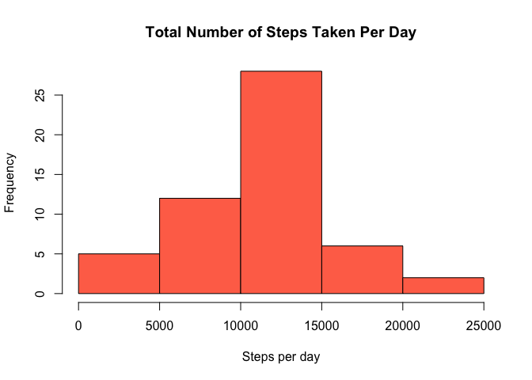
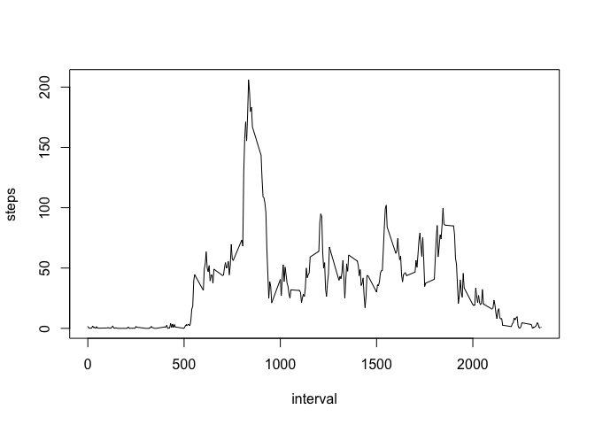
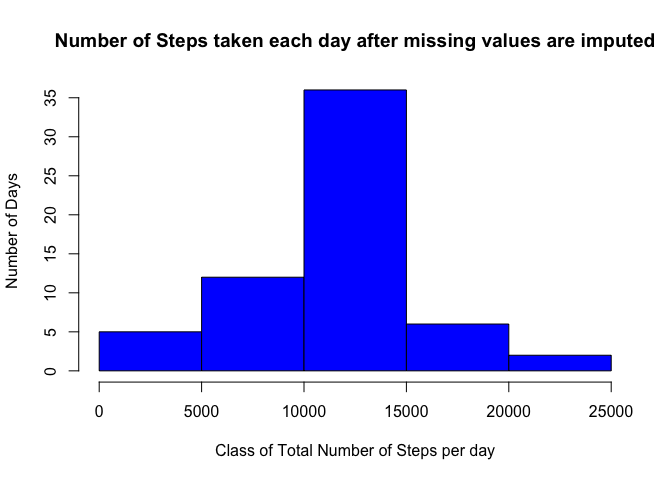
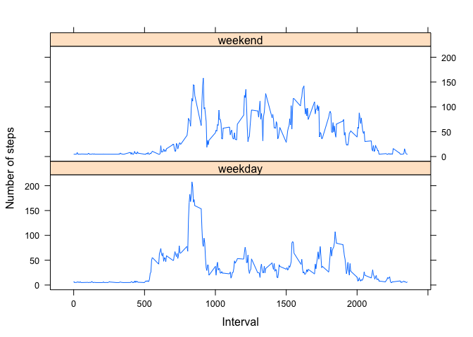

## Unzip zip file

```r
unzip(zipfile = "/Users/kumarshaket/Downloads/repdata_data_activity.zip",exdir = "/Users/kumarshaket/Desktop/Coursera/datafiles")
```
## Loading and preprocessing the data
Load the data 

```r
activity <- read.csv(file = "/Users/kumarshaket/Desktop/Coursera/datafiles/activity.csv",header = TRUE,sep = ",")
head(activity)
```

```
##   steps       date interval
## 1    NA 2012-10-01        0
## 2    NA 2012-10-01        5
## 3    NA 2012-10-01       10
## 4    NA 2012-10-01       15
## 5    NA 2012-10-01       20
## 6    NA 2012-10-01       25
```
Process/transform the data (if necessary) into a format suitable for your analysis

```r
attr(activity$date,"tzone")<-"Asia/Calcutta"
activity$date=gsub("-","",activity$date)
```
Calculate the total number of steps taken per day

```r
stepsperday <- aggregate(steps ~ date,activity,sum, na.rm=TRUE)
```
## Histogram of the total number of steps taken each day

```r
hist(stepsperday$steps, main = "Total Number of Steps Taken Per Day", xlab = "Steps per day",col = ("coral1"))
```

<!-- -->
## What is mean total number of steps taken per day?

```r
meanstepsperday <- mean(stepsperday$steps)
meanstepsperday
```

```
## [1] 10766.19
```
Calculate the median of the total number of steps taken per day

```r
medianstepsperday <- median(stepsperday$steps)
medianstepsperday
```

```
## [1] 10765
```
## What is the average daily activity pattern?
Make a time series plot (i.e. \color{red}{\verb|type = "l"|}type = "l") of the 5-minute interval (x-axis) and the average number of steps taken, averaged across all days (y-axis)


```r
averagedailysteps <- aggregate(steps ~ interval,activity,mean, na.rm=TRUE)
plot(steps~interval,averagedailysteps, type='l')
```

<!-- -->

Which 5-minute interval, on average across all the days in the dataset, contains the maximum number of steps?


```r
maxnumberofsteps <- averagedailysteps[which.max(averagedailysteps$steps),]$interval
```
## Imputing missing values
Calculate and report the total number of missing values in the dataset 

```r
m <- mean(averagedailysteps$steps)
missingIndex<-is.na(activity[,1])
```
Create a new dataset that is equal to the original dataset but with the missing data filled in.

```r
activity_imputedsteps <- activity
activity_imputedsteps[missingIndex,1]<-m
```
## Histogram of the total number of steps taken each day 

```r
totalStepsByDay<-aggregate(steps~date, activity_imputedsteps, sum)
hist(totalStepsByDay$steps, xlab="Class of Total Number of Steps per day", ylab="Number of Days", main="Number of Steps taken each day after missing values are imputed", col = "blue")
```

<!-- -->
Calculate mean of  total number of steps taken per day.

```r
mean_afterImput<-mean(totalStepsByDay$steps)
mean_afterImput
```

```
## [1] 10766.19
```
Calculate median  of  total number of steps taken per day.


```r
median_afterInput <- median(totalStepsByDay$steps)
median_afterInput
```

```
## [1] 10766.19
```
## Are there differences in activity patterns between weekdays and weekends?

```r
activity1 <- read.csv(file = "/Users/kumarshaket/Desktop/Coursera/datafiles/activity.csv",header = TRUE,sep = ",")
averagestepsperday <- aggregate(steps ~ interval,activity1,mean, na.rm=TRUE)
m <- mean(averagestepsperday$steps)
missingIndex<-is.na(activity1[,1])
activityNoNA <- activity1
activityNoNA[missingIndex,1]<-m
activityNoNA$date <- as.Date(strptime(activityNoNA$date, format="%Y-%m-%d"))
head(activityNoNA)
```

```
##     steps       date interval
## 1 37.3826 2012-10-01        0
## 2 37.3826 2012-10-01        5
## 3 37.3826 2012-10-01       10
## 4 37.3826 2012-10-01       15
## 5 37.3826 2012-10-01       20
## 6 37.3826 2012-10-01       25
```
Create a new factor variable in the dataset with two levels – “weekday” and “weekend” indicating whether a given date is a weekday or weekend day.

```r
activityNoNA$day <- weekdays(activityNoNA$date)
for (i in 1:nrow(activityNoNA)) {
    if(activityNoNA[i,]$day%in%c("Saturday","Sunday")){
            activityNoNA[i,]$day<-"weekend"
    }
        else
        {
                activityNoNA[i,]$day <-"weekday"
        }
}
head(activityNoNA)
```

```
##     steps       date interval     day
## 1 37.3826 2012-10-01        0 weekday
## 2 37.3826 2012-10-01        5 weekday
## 3 37.3826 2012-10-01       10 weekday
## 4 37.3826 2012-10-01       15 weekday
## 5 37.3826 2012-10-01       20 weekday
## 6 37.3826 2012-10-01       25 weekday
```

```r
stepsByDay = aggregate(steps ~ interval + day,activityNoNA,mean)
```
## Panel Plot

```r
library(lattice)
xyplot(steps ~ interval | day, stepsByDay, type = "l", layout = c(1, 2), 
    xlab = "Interval", ylab = "Number of steps")
```

<!-- -->
